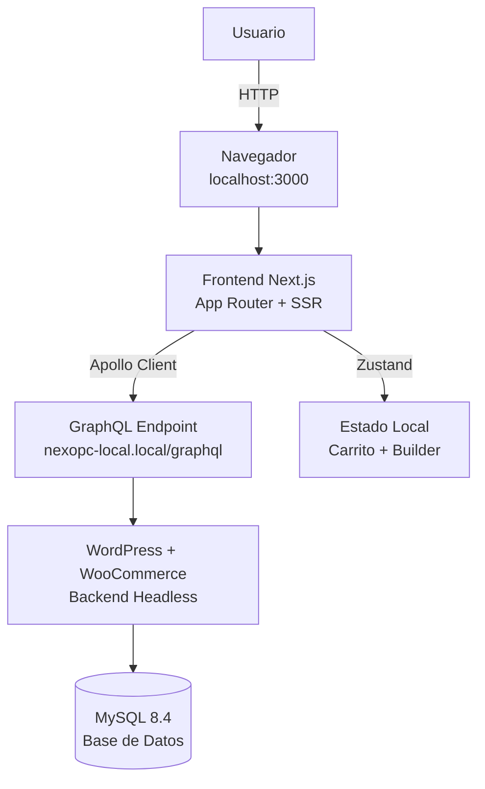

<div align="center">

# 🖥️ NexoPC — Frontend

### E-commerce headless de hardware y ensamblaje de PC gamer

[](https://nextjs.org/)
[](https://www.typescriptlang.org/)
[](https://tailwindcss.com/)
[](https://www.apollographql.com/)
[](https://zustand-demo.pmnd.rs/)

**Universidad Privada del Norte** · Curso: E-Business y Analítica Web · Trujillo, Perú · 2026

</div>

---

## 📖 Tabla de Contenidos

- [Descripción General](#-descripción-general)
- [Características Principales](#-características-principales)
- [Stack Tecnológico](#-stack-tecnológico)
- [Arquitectura del Sistema](#-arquitectura-del-sistema)
- [Requisitos Previos](#-requisitos-previos)
- [Instalación Paso a Paso](#-instalación-paso-a-paso)
- [Estructura del Proyecto](#-estructura-del-proyecto)
- [Scripts Disponibles](#-scripts-disponibles)
- [Flujo de Trabajo con Git](#-flujo-de-trabajo-con-git)
- [Solución de Problemas](#-solución-de-problemas)
- [Equipo y Contacto](#-equipo-y-contacto)

---

## 🎯 Descripción General

**NexoPC Frontend** es la aplicación web del proyecto NexoPC, un e-commerce especializado en la **venta de componentes de PC** y el **ensamblaje de configuraciones personalizadas** para gamers, streamers, creadores de contenido y profesionales.

### ¿Qué hace único a NexoPC?

| Diferencial | Descripción |
|-------------|-------------|
| 🔧 **Configurador inteligente** | Valida compatibilidad entre componentes (socket, tipo RAM, TDP, dimensiones) en tiempo real. |
| 🎥 **Certificado en video** | Cada PC ensamblada se entrega con un video de pruebas de estrés grabado. |
| 📋 **SLA de postventa visible** | Plazos de garantía, entrega y canal de reclamo visibles antes de comprar. |
| 💳 **Pagos locales** | Integración con Culqi (Yape, Plin, tarjetas, BNPL). |

### Arquitectura Headless

Este frontend consume datos de un **backend WordPress + WooCommerce** a través de una **API GraphQL**. No está acoplado a un CMS tradicional, lo que permite:

- ✅ Máxima velocidad de carga (SSR/SSG con Next.js).
- ✅ SEO optimizado para cada producto.
- ✅ Experiencia de usuario tipo SPA.
- ✅ Escalabilidad independiente del backend.

---

## ✨ Características Principales

### ✅ Implementadas

- [x] **Home page** con hero, productos destacados y llamados a la acción.
- [x] **Catálogo de productos** (`/tienda`) con grid responsive.
- [x] **Ficha de producto** (`/producto/[slug]`) con imágenes, precio, stock y descripción.
- [x] **Carrito de compras** persistente (localStorage vía Zustand).
- [x] **Header y Footer** con navegación y contador de carrito en tiempo real.
- [x] **Conexión GraphQL** con WordPress vía Apollo Client.
- [x] **Diseño oscuro** con identidad visual de marca (naranja/negro).

### 🚧 En desarrollo

- [ ] **Configurador de PC** con validación de compatibilidad en tiempo real.
- [ ] **Checkout con Culqi** (sandbox y producción).
- [ ] **Creación de pedidos** en WooCommerce vía REST API.
- [ ] **Página de confirmación** post-compra.

### 📋 Próximas funcionalidades

- [ ] **Autenticación de usuarios** (JWT).
- [ ] **Historial de pedidos** (`/mi-cuenta`).
- [ ] **Búsqueda de productos** con filtros.
- [ ] **Chatbot de atención** (Tidio/Chatra).
- [ ] **Blog SEO** con artículos educativos.
- [ ] **Sistema de reseñas** de productos.

---

## 🛠️ Stack Tecnológico

### Frontend

| Tecnología | Versión | Propósito |
|------------|---------|-----------|
| **Next.js** | 16.3.5 | Framework React con App Router y Turbopack |
| **React** | 19.x | Librería de UI |
| **TypeScript** | 5.x | Tipado estático |
| **Tailwind CSS** | 4.x | Framework de estilos utility-first |
| **Apollo Client** | 3.x | Cliente GraphQL |
| **Zustand** | 5.x | Gestión de estado global (carrito, configurador) |
| **React Culqi** | 1.x | Integración con la pasarela de pagos peruana |

### Backend (repositorio separado)

| Tecnología | Versión | Propósito |
|------------|---------|-----------|
| **WordPress** | 7.1.1 | CMS base |
| **WooCommerce** | 11.1.1 | Motor de e-commerce |
| **WPGraphQL** | 2.23.0 | API GraphQL |
| **WooGraphQL** | 0.21.2 | Extensión WooCommerce para GraphQL |
| **JWT Authentication** | 1.5.0 | Autenticación de usuarios |

### Herramientas de Desarrollo

| Herramienta | Propósito |
|-------------|-----------|
| **VS Code** | Editor recomendado |
| **Antigravity IDE** | IDE alternativo con IA integrada |
| **Git + GitHub** | Control de versiones |
| **LocalWP** | Servidor local del backend |
| **npm** | Gestor de paquetes |

---

## 🏗️ Arquitectura del Sistema

El proyecto usa una arquitectura **headless** donde el frontend (Next.js) y el backend (WordPress) son aplicaciones independientes que se comunican por GraphQL.



### Componentes principales

| Capa | Componente | Responsabilidad |
|------|------------|-----------------|
| **Cliente** | Navegador | Interfaz visual del usuario |
| **Frontend** | Next.js 16 | Renderizado, routing, SSR/SSG |
| **Estado** | Zustand | Carrito y configurador (local) |
| **API** | Apollo Client | Consultas GraphQL con caché |
| **Backend** | WordPress + WooCommerce | Gestión de productos, pedidos, usuarios |
| **API GraphQL** | WPGraphQL + WooGraphQL | Exposición de datos al frontend |
| **Base de datos** | MySQL 8.4 | Persistencia de datos |

---

## 📋 Requisitos Previos

Antes de empezar, asegúrate de tener instalado:

| Herramienta | Versión mínima | Cómo verificar |
|-------------|----------------|----------------|
| **Node.js** | 20.x | `node --version` |
| **npm** | 10.x | `npm --version` |
| **Git** | 2.x | `git --version` |
| **LocalWP** | Última | Descargar de [localwp.com](https://localwp.com/) |
| **VS Code** | Última | Descargar de [code.visualstudio.com](https://code.visualstudio.com/) |

---

## 🚀 Instalación Paso a Paso

### 1. Clonar el repositorio

```bash
git clone https://github.com/TU-USUARIO/nexopc-frontend.git
cd nexopc-frontend
```

### 2. Instalar dependencias

```bash
npm install
```

### 3. Configurar variables de entorno

Crea un archivo `.env.local` en la raíz del proyecto con:

```env
NEXT_PUBLIC_WORDPRESS_URL=http://nexopc-local.local
NEXT_PUBLIC_GRAPHQL_URL=http://nexopc-local.local/graphql
WC_CONSUMER_KEY=ck_tu_clave_aqui
WC_CONSUMER_SECRET=cs_tu_clave_aqui
NEXT_PUBLIC_SITE_URL=http://localhost:3000
NEXT_PUBLIC_CULQI_PUBLIC_KEY=pk_test_tu_llave_aqui
```

**IMPORTANTE:** Pide las claves de WooCommerce al líder del equipo. NO las subas a GitHub.

### 4. Verificar que el backend esté corriendo

Antes de ejecutar el frontend, asegúrate de que:

- LocalWP esté abierto y el sitio `nexopc-local` esté iniciado (botón verde).
- Puedas acceder a `http://nexopc-local.local/wp-admin`.

### 5. Ejecutar el servidor de desarrollo

```bash
npm run dev
```

### 6. Abrir en el navegador

```
http://localhost:3000
```

---

## 📁 Estructura del Proyecto

```
src/
├── app/                      # Páginas (App Router)
│   ├── page.tsx              # Home
│   ├── tienda/page.tsx       # Catálogo
│   ├── producto/[slug]/      # Ficha de producto
│   ├── carrito/page.tsx      # Carrito
│   ├── checkout/page.tsx     # Checkout
│   ├── arma-tu-pc/page.tsx   # Configurador
│   └── api/orders/           # API Route para crear pedidos
├── components/               # Componentes reutilizables
│   ├── Header.tsx
│   ├── Footer.tsx
│   ├── ProductCard.tsx
│   └── AddToCartButton.tsx
├── lib/                      # Utilidades
│   ├── apollo/               # Apollo Client
│   ├── graphql/              # Queries GraphQL
│   ├── compatibility/        # Reglas de compatibilidad
│   └── utils/                # Funciones auxiliares
├── store/                    # Estado global (Zustand)
│   ├── cartStore.ts
│   └── builderStore.ts
└── types/                    # Tipos TypeScript
```

---

## 🔧 Scripts Disponibles

| Comando | Descripción |
|---------|-------------|
| `npm run dev` | Servidor de desarrollo en `http://localhost:3000` |
| `npm run build` | Compila para producción |
| `npm start` | Inicia el servidor de producción |
| `npm run lint` | Ejecuta ESLint |

---

## 🌳 Flujo de Trabajo con Git

### Antes de empezar a trabajar

```bash
git pull origin main
```

### Crear una rama para tu funcionalidad

```bash
git checkout -b feat/nombre-de-tu-tarea
```

### Guardar cambios

```bash
git add .
git commit -m "feat: descripción corta de lo que hiciste"
git push origin feat/nombre-de-tu-tarea
```

### Crear un Pull Request en GitHub

1. Ve al repositorio en GitHub.
2. Verás un aviso "Compare & pull request".
3. Describe los cambios y solicita revisión.

### Convenciones de commits

- `feat:` nueva funcionalidad
- `fix:` corrección de bug
- `docs:` documentación
- `style:` estilos (CSS, formato)
- `refactor:` refactorización de código
- `chore:` tareas de mantenimiento

---

## 🐛 Solución de Problemas Comunes

### Error: "No se pudieron cargar los productos"

1. Verifica que LocalWP esté corriendo.
2. Verifica que `http://nexopc-local.local/graphql` responda.
3. Revisa que `.env.local` tenga las URLs correctas.
4. Reinicia el servidor: `Ctrl+C` y `npm run dev`.

### Error: "CORS policy"

- El backend no permite peticiones desde `localhost:3000`.
- Solución: Verificar que el mu-plugin `nexopc-cors.php` esté activo en el backend (ver README del backend).

### Error: "Cannot query field products"

- WooGraphQL no está activo o HPOS está habilitado.
- Solución: Ver README del backend.

---

## 📞 Contacto

- **Repositorio frontend:** https://github.com/xWrkz/NexoPC
- **Repositorio backend:** https://github.com/xWrkz/nexopc-backend
- **Equipo:** Marco Gamez, Hiroshi Icochea, Kevin Ventura
- **Curso:** E-Business y Analítica Web - UPN
- **Email:** contacto.nexopc@gmail.com
- **Ubicación:** Trujillo, La Libertad, Perú

---

<div align="center">

**Hecho con ❤️ en Trujillo, Perú**

⭐ Si te gusta este proyecto, dale una estrella en GitHub ⭐

</div>